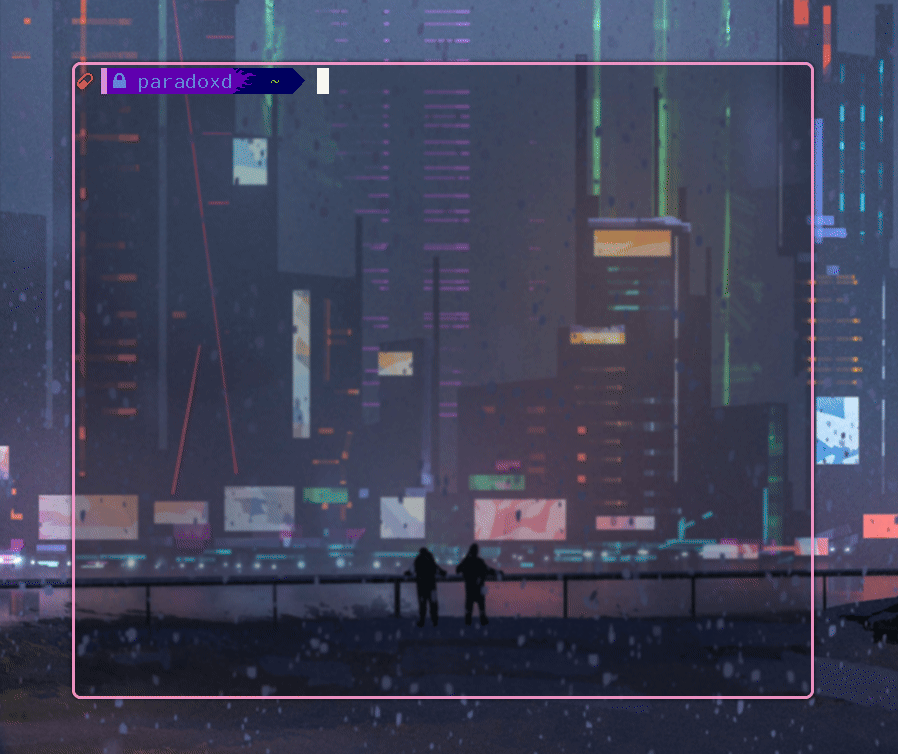
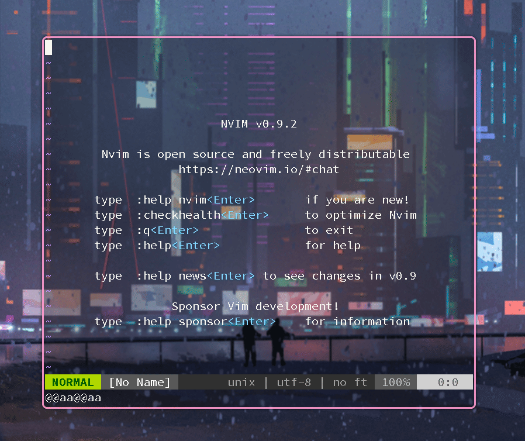
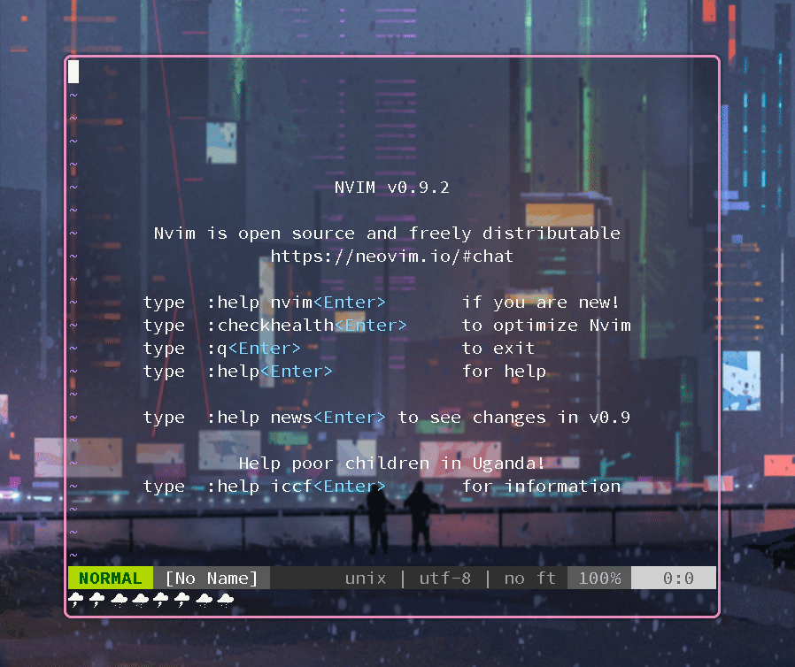
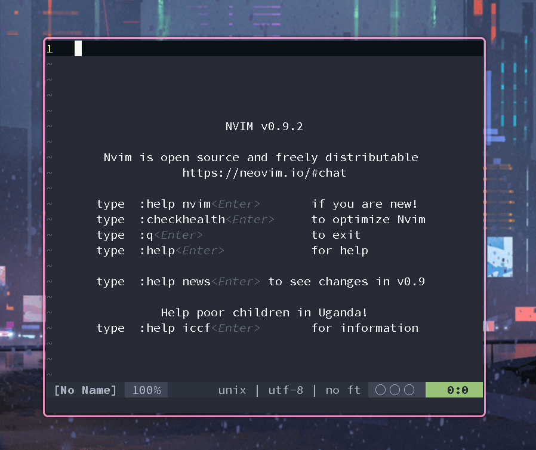
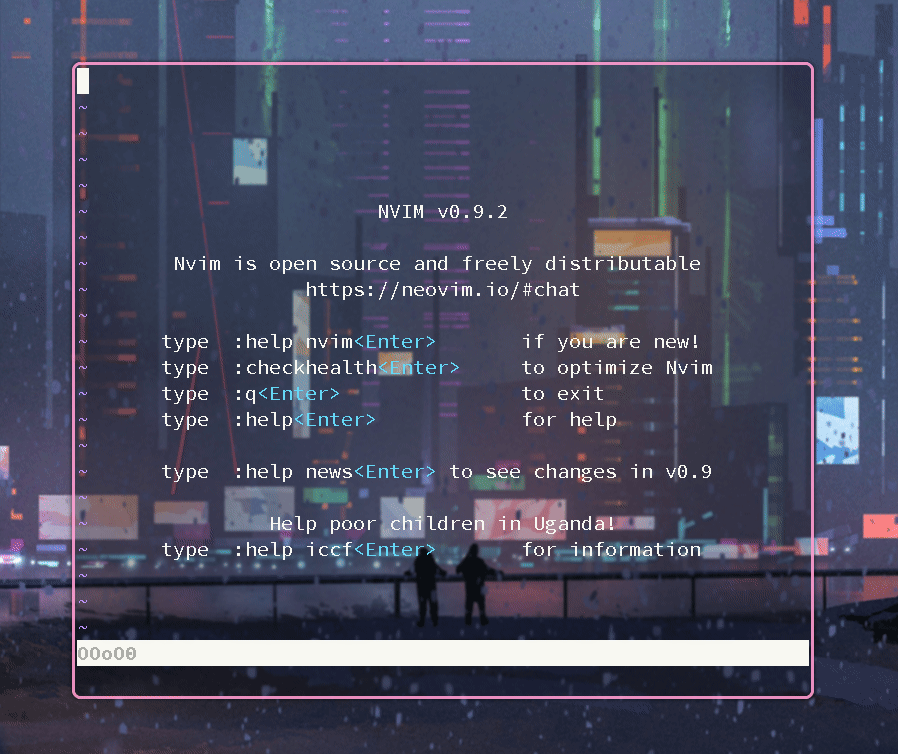

# boringBubble.nvim

✨ A boring plugin for bored XD

>   echo BORING bubble string like **o 0 O** in vim coding.
>
>   Bubble will change when you coding.
>
>   Ported from [vimscript version](https://github.com/paradoxskin/boringBubble.vim)

💥 warning: This plugin may affect your programming efficiency

### Preview



### Installation

You can install it in your way like other vim plugin.

If you have no experience in installing plugins, I recommend you install them using the method provided by the official vim documentation, it's very easy to install a vim plugin.

*   linux

    `cd` to your `~/.config/nvim/pack/%ANY%/start` or `~/.config/nvim/%ANY%/opt` ( replace `%ANY%` as you wish ), then

    `git clone https://github.com/paradoxskin/boringBubble.nvim.git`

    you can also use git-submodule to manage it.
    
    Then, in your config file:
    
    ```lua
    require("boringBubble").setup()
    ```
    
    

### Usage

default options:

```lua
require("boringBubble").setup({
    bubble = {
        map = {"o", "O", "0"},
        len = 5,
        event = {"TextChanged", "TextChangedI"} -- autocmd
    },
    fun = {
        draw = function (bubble) -- called after generate new bubble
            vim.g.bubble = bubble
        end,
        prize = function (number) -- called when all char same
        end
    }
})
```

For example, add it in your config file:

```lua
require("boringBubble").setup({
    bubble = {
        map = {"@", "a"},
        len = 8
    },
    fun = {
        draw = function(bubble)
            print(bubble)
        end
    }
}
```

it will be like:



Of couse, you can use [nerd charaters](https://www.nerdfonts.com/)



*   You can get the Bubble by `g:bubble`. So it can also echoed in your status-line, if you use [lightline.vim](https://github.com/itchyny/lightline.vim)  or other
    my config:

    ```lua
    -- lightline
    vim.g.lightline = {
        colorscheme = 'paradoxskin',
        active = {
            left = {{'filename'}, {'percent'}, {'modified', 'readonly'}},
            right = {{'lineinfo'}, {'bubble'}, {'fileformat', 'fileencoding', 'filetype'}}
        },
        component = {
            bubble = '%{g:bubble}'
        },
    }
    
    -- boringBubble.nvim
    require("boringBubble").setup({
        bubble = {
            map = {" ", " "},
            len = 3
        }
    }
    ```
    
    
    For pure:
    
    ```vim
    set statusline+=%{g:bubble}
    ```
    
    

✨ ENJOY:D


Welcome PR if you have any interesting ideas.
